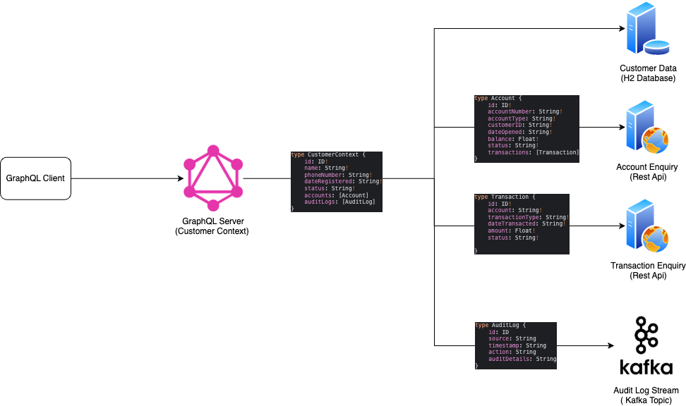

## Architecture Diagram
Purpose of this project is to implement a simple GraphQL Server using real world scenario
Implemented 3 types of data sources as backend :

    - Database (m2) 
    - Rest API 
    - Kafka Topic

### Useful Scripts

#### Export Database from H2 Console 
`SCRIPT TO 'data.sql'`